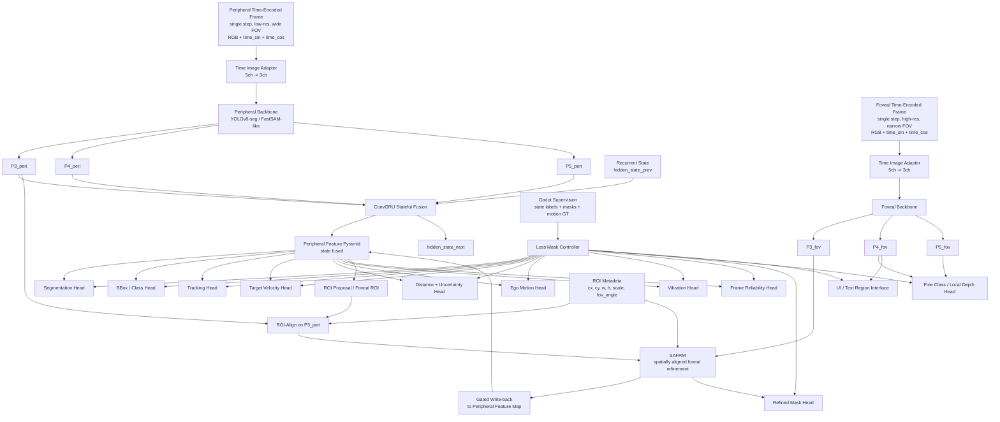

# TAO-NOT-42 Model Structure Design Specification v1.1

This document defines the first-stage visual perception model baseline for TAO-NOT-42. The goal is not a general visual foundation model and not a pure reinforcement learning system. The goal is a unified, mixed-state, multi-head visual perception model trained from Godot 3D supervision.

The baseline may later replace the concrete backbone, temporal module, or head implementation, but the following contracts must remain stable: core interfaces, responsibility split, spatial alignment rules, and loss-mask rules.

## 1. Design Principles

### 1.1 Unified Mixed-State Joint Training

Training mixes these scene states in one framework:

- `stable_fixation`
- `prompt_selection`
- `micro_motion_parallax`
- `occlusion_reacquisition`
- `fast_rotation`
- `strong_vibration`
- `boundary_teleport_event`

The model should share representation learning for appearance, motion, occlusion, ego motion, vibration, and frame reliability. Do not split the first-stage model into independent `V1 -> V2 -> V3` training projects.

### 1.2 CameraRig Is a Controlled Moving Body

`CameraRig` / `HeadPivot` is mounted on a controlled moving platform, not a static observer.

The main global movement pattern is forward movement around the arena. At a boundary or boundary zone, the platform may teleport to a valid continuation position. This is a sampling-system event, not a physical continuous motion for the model to regress.

The data stream must distinguish:

- `global_forward_motion`
- `local_translation`
- `local_rotation`
- `vibration_motion`
- `boundary_teleport_event`

Frames marked `boundary_teleport_event` may remain in the image dataset, but continuous-motion losses must be disabled for the teleport discontinuity.

### 1.3 CameraRig Ego-Motion Ground Truth

Godot must export ego-state supervision:

- CameraRig linear velocity.
- CameraRig angular velocity.
- Platform local acceleration.
- Platform local angular acceleration.
- Vibration class.
- Frame reliability.
- Boundary teleport flag.

Teleport frames must not train target velocity or ego-motion velocity as ordinary continuous motion.

### 1.4 Bad Frames Do Not Train Target-Related Losses

When the state is `fast_rotation`, `strong_vibration`, or a visually discontinuous `boundary_teleport_event`, disable target-related losses:

- segmentation
- bbox
- tracking
- target velocity
- target distance
- distance uncertainty

Training-time loss masks must come from Godot ground truth, never from model predictions. Predicted reliability and vibration are inference-time gates only.

### 1.5 Peripheral-Foveal Responsibility Split

Peripheral is the global branch:

- full-scene context
- wide-FOV discovery
- coarse localization and class prediction
- ego-motion estimation
- scene-state prediction
- ROI proposal

Foveal is the local refinement branch:

- high-resolution recognition
- refined mask
- local depth refinement
- fine-grained class refinement
- optional UI/text-region interface when Godot labels exist

Foveal refines Peripheral. It is not a second full-scene copy.

### 1.6 Spatial Alignment Is Mandatory

Do not directly concatenate Peripheral and Foveal feature maps. Peripheral feature coordinates cover the full scene; Foveal feature coordinates cover only the current gaze region.

Correct fusion flow:

1. Compute the Foveal ROI from `HeadPivot` / `FovealCamera` geometry.
2. Project the Foveal ROI into Peripheral image coordinates.
3. Run ROI-Align on Peripheral features.
4. Add position conditioning to Foveal features.
5. Fuse aligned local features.
6. Write the refinement back into the corresponding Peripheral feature region through a gate.

## 2. Inputs

### 2.1 Image Input

The model call consumes one time step at a time. It does not receive a stacked multi-frame RGB tensor.

```text
input_t = {
  peripheral_time_image_t,
  foveal_time_image_t,
  metadata_t,
  recurrent_state_prev
}
```

Each visual input is a single RGB frame with time encoding planes:

```text
peripheral_time_image_t: [5, H_peri, W_peri]
foveal_time_image_t:     [5, H_fov, W_fov]

channels = [
  R,
  G,
  B,
  time_sin,
  time_cos
]
```

`time_sin` and `time_cos` are image-sized planes broadcast from the current frame index:

```text
time_phase = 2*pi*(frame_index mod 256)/256
time_sin = sin(time_phase)
time_cos = cos(time_phase)
```

Temporal accumulation happens inside the model through recurrent hidden state, not by passing multiple RGB frames as input.

Training may use variable temporal intervals between successive model steps. With a 60 Hz base simulation/capture timeline, supported first-stage frame strides are:

| `frame_skip` | Effective rate | `delta_time_seconds` |
| ---: | ---: | ---: |
| `1` | 60 Hz | `1/60` |
| `2` | 30 Hz | `2/60` |
| `3` | 20 Hz | `3/60` |
| `4` | 15 Hz | `4/60` |

This is a sampling policy over single-frame inputs. It does not turn the model input back into a multi-frame tensor.

Recommended first-stage ranges:

```text
Peripheral: 160x90 or 224x126, padded to stride-compatible size when needed
Foveal:     128x128 or 224x224
Input step: one current frame
Training unroll: implementation detail for BPTT, not an input tensor dimension
Frame stride: randomly sampled from 1, 2, 3, 4
```

### 2.2 Prompt Input

Supported prompt forms:

- point prompt
- box prompt
- class prompt
- optional mask prompt

The first-stage prompt behavior follows a FastSAM-style split:

1. Generate candidate instances.
2. Select the target according to the prompt.

Prompt encoding must not replace temporal fusion.

### 2.3 Camera and Gaze Metadata

Each frame records:

```text
foveal_roi = {
  cx,
  cy,
  w,
  h,
  scale,
  fov_angle
}
```

Also record:

- frame index.
- episode time in seconds.
- delta time since previous step.
- frame skip since previous model step.
- HeadPivot rotation.
- CameraRig global forward velocity.
- CameraRig local linear velocity.
- CameraRig local angular velocity.
- vibration level.
- scene state.
- boundary teleport flag.

## 3. Godot Supervision Export

The first-stage training flow is offline. Godot generates persisted supervised dataset batches before Python training consumes them. Python does not synchronously drive Godot during optimizer updates.

Each generated dataset batch is planned at `20 GB` nominal size. Python loads the complete dataset batch into RAM, trains on that loaded batch, then discards it before consuming the next generated batch.

### 3.1 Target Ground Truth

```text
prompt_type
prompt_payload
target_id
object_class
track_id
visible
occluded
mask
bbox
center_point
world_position
screen_position
screen_velocity
world_velocity
```

`world_velocity` and `screen_velocity` are valid only in ordinary continuous-motion states.

### 3.2 Distance and Uncertainty Ground Truth

Do not default to object-center distance or minimum mask depth. Prefer stable per-target definitions:

- ordinary target: low percentile mask depth, such as 5% or 10%
- thin target: median, mode, or bbox-center ray depth
- special target: nearest collision-shape point

First-stage export:

```text
distance_gt
depth_spread_gt
visible_area_ratio
occlusion_ratio
```

### 3.3 Ego Motion and Vibration Ground Truth

```text
camera_global_forward_velocity
camera_local_linear_velocity
camera_local_angular_velocity
platform_acceleration
platform_angular_acceleration
vibration_class
fast_rotation_flag
strong_vibration_flag
frame_reliability_gt
boundary_teleport_flag
```

Vibration classes:

```text
0 = stable
1 = mild_vibration
2 = strong_vibration
```

### 3.4 Scene-State Labels

```text
stable_fixation
prompt_selection
micro_motion_parallax
occlusion_reacquisition
fast_rotation
strong_vibration
boundary_teleport_event
```

`boundary_teleport_event` is a sampler/system state, not a physical-motion state.

### 3.5 Loss Masks

```text
target_mask
segmentation_mask
tracking_mask
target_velocity_mask
target_distance_mask
distance_uncertainty_mask
ego_motion_mask
vibration_mask
reliability_mask
foveal_refinement_mask
ocr_or_ui_mask
teleport_mask
```

All loss activation is controlled by ground-truth masks.

## 4. Model Structure

Data flow:

```text
Peripheral time-encoded frame
    -> Peripheral Backbone + FPN/PAN
    -> ConvGRU Stateful Fusion
    -> Peripheral Heads

Foveal time-encoded frame
    -> Foveal Backbone
    -> Foveal Features

ROI Metadata
    -> ROI-Align Peripheral Features
    -> SAFRM
    -> Gated Write-back to Peripheral Feature Map
    -> Foveal / Refined Heads
```



## 5. Backbone

Recommended backbone family:

```text
YOLOv8-seg / FastSAM-like
```

Required properties:

- multi-scale features
- segmentation
- detection
- tracking extension point
- prompt-guided selection
- multi-head extension points

Peripheral outputs:

```text
P3_peri
P4_peri
P5_peri
```

Foveal outputs:

```text
P3_fov
P4_fov
P5_fov
```

`P3_fov` is the main local-refinement feature. `P4_fov` and `P5_fov` support fine class, local depth, and optional UI/text-region heads.

### 5.1 Concrete Network Parameters

The v1.1 design baseline uses the following explicit network parameters. These values define the documented network configuration; implementation may later expose them through a config file without changing the interfaces.

Input parameters:

| Parameter | Peripheral | Foveal |
| --- | ---: | ---: |
| Raw render size | `224x126` | `224x224` |
| Network padded size | `224x128` | `224x224` |
| Input channels | `5` | `5` |
| Channel order | `RGB,time_sin,time_cos` | `RGB,time_sin,time_cos` |
| Time period | `256` frames | `256` frames |
| Batch input shape | `[B,5,128,224]` | `[B,5,224,224]` |

Time image adapter, used before a 3-channel YOLOv8-seg / FastSAM-like backbone:

| Layer | Kernel | Channels | Activation | Parameters |
| --- | ---: | ---: | --- | ---: |
| `time_adapter_conv0` | `3x3` | `5 -> 16` | SiLU | `736` |
| `time_adapter_conv1` | `1x1` | `16 -> 3` | none | `51` |
| Adapter subtotal per branch | - | - | - | `787` |
| Adapter subtotal, two branches | - | - | - | `1,574` |

Feature pyramid parameters:

| Level | Stride | Peripheral shape | Foveal shape | Channels |
| --- | ---: | ---: | ---: | ---: |
| `P3` | `8` | `28x16` | `28x28` | `64` |
| `P4` | `16` | `14x8` | `14x14` | `128` |
| `P5` | `32` | `7x4` | `7x7` | `256` |

Stateful temporal parameters:

| Parameter | Value |
| --- | ---: |
| Temporal input style | one frame per call |
| State carrier | ConvGRU hidden state |
| Required ConvGRU level | `P3_peri` |
| P3 hidden channels | `64` |
| P3 hidden shape | `[B,64,16,28]` |
| P3 kernel | `3x3` |
| P3 ConvGRU parameters | `221,376` |
| Hidden initialization | zeros on episode start |
| Hidden teleport behavior | reset or gated decay |
| Trainer unroll window | `8` steps for BPTT planning |
| Training frame stride | random `1,2,3,4` |
| Effective rates | `60,30,20,15 Hz` at 60 Hz base capture |
| Optional later extension | `P4_peri`, `P5_peri` |

SAFRM parameters:

| Parameter | Value |
| --- | ---: |
| ROI feature level | `P3` |
| ROI output size | `28x28` |
| ROI metadata fields | `6` |
| ROI metadata MLP | `6 -> 32 -> 128` |
| Foveal modulation | `gamma,beta` for `64` channels |
| Fusion block | `1x1 conv 128->64`, `3x3 conv 64->64`, residual |
| Gate | `1x1 conv 64->1`, sigmoid |
| SAFRM parameters | `53,857` |

Documented parameter budget:

| Configuration | Parameters |
| --- | ---: |
| Dual YOLOv8n-seg-like branches | `6,800,000` |
| Time image adapters, two branches | `1,574` |
| P3 ConvGRU | `221,376` |
| SAFRM | `53,857` |
| Active extra heads | `336,967` |
| Documented total | `7,413,774` |

Output head parameters:

| Head | Output channels |
| --- | ---: |
| tracking embedding | `32` |
| target velocity | `2` |
| distance + uncertainty | `2` |
| ego motion | `12` |
| vibration | `3` |
| frame reliability | `1` |
| visibility confidence | `1` |
| refined mask | `1` |
| fine class + local depth | `17` |
| optional UI/text interface | `1` |

## 6. Temporal Fusion

Unified interface:

```text
TemporalFusionBase.forward(
    features_t,
    hidden_state_prev,
    metadata_t
)
```

Output:

```text
features_t_fused
hidden_state_next
```

First-stage temporal module:

```text
ConvGRU
```

ConvGRU is preferred because it preserves 2D spatial structure while accumulating state across a single-frame stream. The model receives only the current time-encoded frame at each call; temporal evidence is integrated through `hidden_state_prev -> hidden_state_next`. It should operate on `P3_peri` in the documented v1.1 configuration; if compute allows later, it can be extended to `P4_peri` and `P5_peri`.

When training with variable frame stride, `metadata_t` must include `delta_time_seconds` and `frame_skip`. Velocity targets should remain physical rates, such as units per second or pixels per second. Displacement-style labels must be tied to the actual `delta_time_seconds`.

Mamba / VMamba are later replacement candidates. RWKV is not recommended for the first-stage visual module.

## 7. SAFRM: Spatially-Aligned Foveal Refinement Module

SAFRM aligns Foveal and Peripheral ROI features, fuses local detail, and writes the result back to the Peripheral feature map.

Inputs:

```text
P3_peri
P3_fov
foveal_roi
```

Step 1: ROI-Align

```text
P3_peri_roi = ROIAlign(P3_peri, foveal_roi)
```

Step 2: position modulation

```text
gamma, beta = MLP(foveal_roi_metadata)
P3_fov_mod = gamma * P3_fov + beta
```

Step 3: local fusion

```text
fused_roi = FusionConv(concat(P3_peri_roi, P3_fov_mod))
```

Recommended fusion block:

```text
1x1 conv -> 3x3 conv -> residual
```

Step 4: gated write-back

```text
updated_roi = P3_peri_roi + gate * delta
```

The write-back gate is required to avoid contaminating global features with unreliable local refinement.

## 8. Output Heads

Peripheral heads:

- segmentation
- bbox
- class
- tracking
- visibility confidence
- target velocity
- distance
- distance uncertainty
- ego motion
- vibration
- frame reliability

Foveal / refined heads:

- refined mask
- fine-grained class
- local depth refinement
- UI/text-region interface

The UI/text-region interface is only an interface location until Godot provides matching labels.

## 9. Loss Design

Total loss:

```text
L_total =
  L_target_related * target_mask
+ L_ego_motion * ego_motion_mask
+ L_vibration * vibration_mask
+ L_reliability * reliability_mask
+ L_foveal * foveal_refinement_mask
```

Every head loss is normalized by active samples:

```text
L = sum(active_loss) / active_samples
```

Do not normalize by total batch size.

For `fast_rotation` and `strong_vibration`:

```text
target_mask = 0
ego_motion_mask = 1
vibration_mask = 1
reliability_mask = 1
```

For `boundary_teleport_event`:

```text
target_velocity_mask = 0
ego_motion_mask = 0
tracking_mask = 0
reliability_mask = 1
teleport_mask = 1
```

Segmentation / bbox losses may remain enabled only if the post-teleport frame is visually clear and labels remain valid.

Distance loss:

```text
SmoothL1
```

Optional heteroscedastic distance form:

```text
exp(-s) * |d_pred - d_gt| + s
```

Enable heteroscedastic distance only after stable uncertainty labels are exported.

## 10. Batch Sampling

Initial mixed-state sampling:

```text
stable_fixation:          25%
prompt_selection:         20%
micro_motion_parallax:    20%
occlusion_reacquisition:  15%
fast_rotation:            10%
strong_vibration:         10%
```

`boundary_teleport_event` is not actively sampled as an ordinary visual state. It is recorded when naturally produced by the moving platform. If teleport events become frequent, reduce their training-batch admission rate at the data layer.

### 10.1 Temporal Stride Sampling

Within ordinary non-teleport segments, train recurrent updates with mixed temporal stride:

```text
frame_skip: 1 -> 60 Hz
frame_skip: 2 -> 30 Hz
frame_skip: 3 -> 20 Hz
frame_skip: 4 -> 15 Hz
```

Recommended initial distribution:

```text
frame_skip_1: 40%
frame_skip_2: 25%
frame_skip_3: 20%
frame_skip_4: 15%
```

Do not sample across `boundary_teleport_event` as if it were a larger frame skip. Teleport still resets or decays recurrent state and disables continuous-motion losses.

## 11. Inference Rules

Inference cannot use Godot ground-truth masks. Update gates use:

```text
frame_reliability
vibration_class
tracking_confidence
visibility_confidence
teleport_detected_or_system_signal
```

Bad frame behavior:

- do not update target state
- hold track state
- increase uncertainty
- wait for stable-frame reacquisition

Teleport behavior:

```text
if boundary_teleport_event:
    hidden_state = reset_or_decay(hidden_state)
    disable_motion_update()
    enable_reacquisition_after_stable_frame()
```

Stable-frame behavior:

- update mask
- update bbox
- update distance
- update velocity
- run Foveal refinement
- update ConvGRU hidden state

## 12. Prohibited First-Stage Shortcuts

Do not:

1. Directly concatenate Peripheral and Foveal features.
2. Train target losses on bad frames.
3. Use model predictions to control training loss masks.
4. Replace temporal fusion with prompt cross-attention.
5. Treat Foveal as a full global scene copy.
6. Train OCR/UI heads without matching Godot labels.
7. Normalize loss by total batch size.
8. Depend on Godot node names.
9. Hard-code Godot label logic into the model.
10. Treat boundary teleport frames as ordinary continuous motion.
11. Describe local perturbations as the main global movement mode.

## 13. Core Summary

Final first-stage structure:

```text
YOLOv8-seg / FastSAM-like backbone
+ Prompt-guided selection
+ ConvGRU stateful fusion
+ Peripheral global heads
+ SAFRM
+ Foveal refinement heads
+ Godot-driven loss mask
+ mixed-state joint training
```

The model should update efficiently on stable frames, hold state through bad frames and boundary jumps, and reacquire targets after stability returns.
